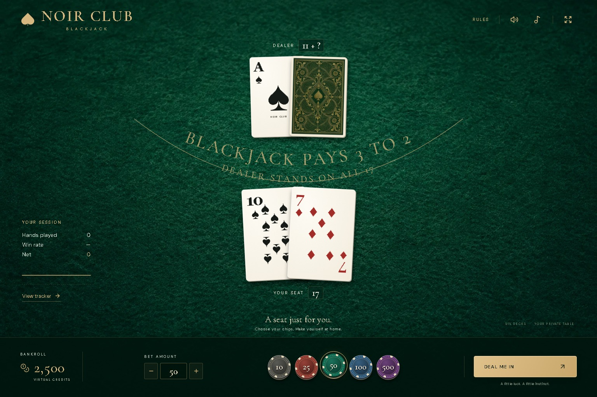

# Noir Club — Blackjack

A private-table atmosphere in your browser: full-bleed emerald felt, ivory cards, brass details, and an original lounge soundtrack. No room, rail, dealer or player figures. Free play with virtual credits only.

[Play Noir Club](https://findahuman.github.io/noir-club-blackjack/)



See the [mobile preview](docs/mobile-preview.jpg) and [initial-release verification report](docs/verification.md). Current checks run in [GitHub Actions](https://github.com/FinDaHuman/noir-club-blackjack/actions).

## Play

- Start with 2,500 credits. Select a chip or enter a wager of 10–500, in steps of 5.
- Hit, stand, double, or split a same-rank pair. Blackjack pays 3:2; the dealer stands on all 17s.
- One split per round, double after split allowed, split aces receive one card. Split 21 pays 1:1.
- Insurance is offered against an Ace before the dealer peeks: a half-bet side wager paying 2:1 on dealer blackjack. A ten-value upcard also triggers a visible peek.
- Late surrender returns half your original wager after blackjack has been ruled out, before hitting, doubling or splitting.
- Open **Learn** for a current-hand adviser, an interactive situation explorer, and hard-total, soft-total and pair strategy charts. Guidance uses six-deck S17/DAS/late-surrender basic strategy, with fallbacks for unavailable actions; it does not count cards or guarantee wins.
- Six decks shuffled with Web Crypto. Reshuffle between rounds below 80 cards.
- Music and effects begin on interaction. Mute them independently from the top bar.
- Keyboard: Space to deal, H to hit, S to stand, D to double, P to split, R to surrender. Shortcuts do not run while typing or when a dialog is open.
- Open the player tracker for bankroll trends, win rate, streaks, blackjacks, surrender counts, insurance results and the last 100 rounds. Insurance is included in round net and total wagered. Surrenders count as losses. Export CSV or reset your session there.
- **Basic-strategy accuracy lives only in the tracker.** See correctly played hands, decision accuracy, and expandable mistake reviews with the cards and dealer upcard at the time, your choice, the recommended action, and its explanation. Nothing is flagged during play. Accuracy updates after a round finishes and measures strategy, regardless of whether you won or lost.
- A hand is correct when every recorded choice is correct. Split hands are graded separately, with shared insurance/split choices counted once in decision accuracy. Recommendations respect available actions and credits. Hands with no choice and unaffordable insurance prompts are excluded. Older rounds and hands already underway before this feature are ungraded; tracking starts with newly dealt hands. Session totals persist beyond the last 100 rounds available for review. CSV exports include accuracy counts, and resetting the session resets accuracy.

The complete session, including an unfinished hand, persists in local storage on this browser and device. New visits start with an empty table; completed hands stay in the tracker, while unfinished hands resume. Older saved balances and stats are preserved. The game remains playable when storage is blocked, with a visible notice. Clearing browser storage clears progress. No account, backend, analytics, purchases, cash-out or real-money wagering.

## Development

Requires Node.js 24 and npm.

```sh
npm ci
npm run dev
npm test
npm run build
npx playwright install chromium webkit
npm run test:e2e
```

React + TypeScript + Vite. Rules and accounting live in `src/game.ts`; audio is synthesized with the Web Audio API in `src/audio.ts`. All assets and fonts are served locally. No third-party runtime services are needed.

## Card visibility and mobile support

The felt is an independent background layer. Card motion stays on a raised rendering layer with visible overflow through every hand/stage ancestor. Cards enter from a nearby point above their resting place; the table is never a clipping plane. Hands fan adaptively to the available width. Reduced-motion settings disable movement. Short viewports scroll naturally rather than cutting off the table or controls.

The test suite checks rules, accounting, strategy grading, saved-session upgrades, and 500-round bankroll invariants, and exercises Chromium and WebKit. Accuracy checks cover split hands, insurance, unavailable actions, outcome-independent grades, completed-round-only display, tracker-only review, CSV export, persistence and reset. Browser tests sample card and face geometry during dealing, splitting, peeking and revealing to detect cards crossing the viewport or the control band. Responsive checks cover widths from 320 to 1536 pixels, portrait and landscape. Browser emulation does not replace a physical-device check.

## GitHub Pages

The `Verify and deploy Noir Club` workflow runs the tests and production build before uploading `dist` and deploying to Pages. Repository Settings → Pages must use **GitHub Actions** as its source. The Vite base path is relative, so assets work under a repository URL. The workflow follows [GitHub's custom Pages workflow documentation](https://docs.github.com/en/pages/getting-started-with-github-pages/using-custom-workflows-with-github-pages).

## Art and audio

Felt and card-back textures were created for this project with the built-in image generator; optimized production files are in `public/assets`. The soundtrack and table effects are original procedural synthesis. Cormorant Garamond and DM Sans are self-hosted via Fontsource under the SIL Open Font License. Lucide icons use the ISC license. See `docs/assets.md` for the art brief and provenance.
